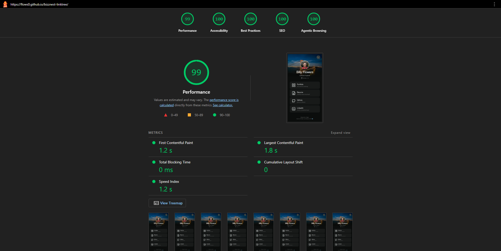

# Associate Technicial Assessment

Linktree-style page in React with one JavaScript feature that brings it to life. Deployed to GitHub Pages.

---

## Features

### Toggle Analytics

Display the total clicks from the last 7 days with a percentage difference from the previous week visualized with a linechart backed by mocked data. I've always wanted to implement graphs or a custom SVG and took this opportunity to do it. Tricky part was structuring data to track the amount of clicks per day and create `x,y` points for a polyline using that data. If I had more time, I would create a database to track link clicks so the data updates in real-time.

### Time-based Emoji

Change emoji in footer based on clients time. If hour is greater than or equal to 6 and less than 20 display 🌞 else 🌚. Simple but interactive way to include client's context inside the application.

---

## Screenshots



---

### Tech Stack

- TypeScript
- React
- Tailwind CSS

---

## Getting Started

### Prerequisites

- Node.js 22+
- npm

### Installation

```bash
git clone https://github.com/flows0/bizznest-linktree.git

cd bizznest-linktree

npm install
```

### Run the Development Server

```dash
npm run dev
```